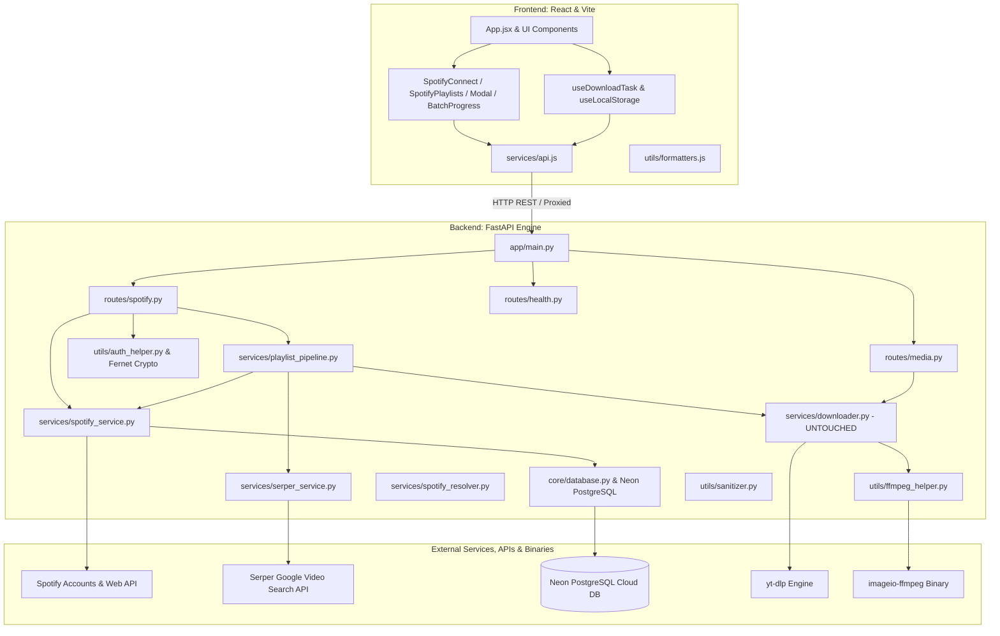
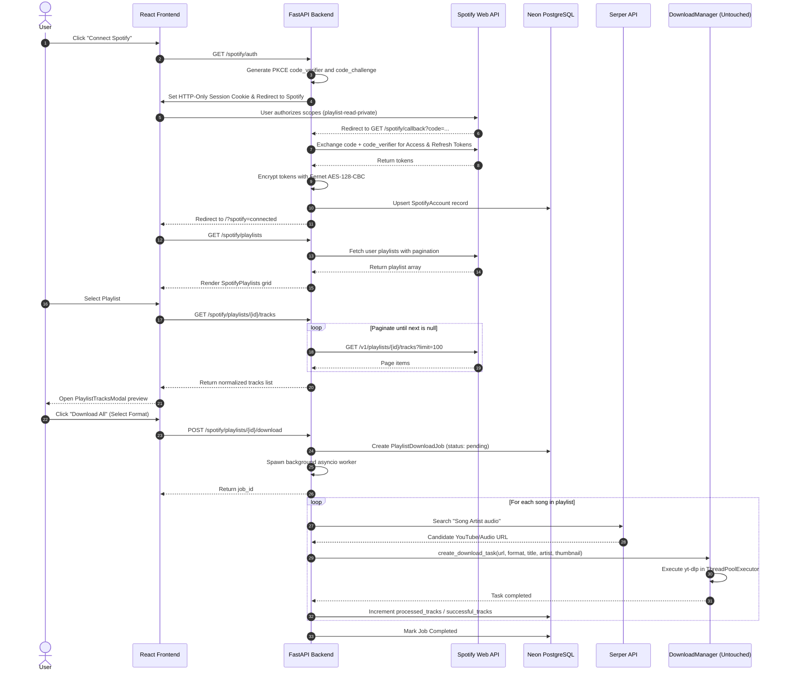

# 🏛️ TuneFetch - System Architecture & Technical Specification

This document provides an exhaustive reference of the architecture, file structures, functions, and cross-module interactions powering the **TuneFetch** platform.

---

## 🗺️ High-Level System Architecture

---

## 🔄 Spotify OAuth & Batch Playlist Sequence Diagram

---

## 📂 File-by-File Technical Specification

### 1. Backend Layer (`backend/app/`)

#### `core/config.py`
- **Class `Settings`**: Central configuration using `pydantic-settings`.
- **Fields**:
  - `DATABASE_URL`: PostgreSQL connection string (Neon DB).
  - `ENCRYPTION_KEY`: Fernet 32-byte urlsafe base64 key for encrypting Spotify tokens.
  - `SESSION_SECRET_KEY`: Signed session secret for HMAC multi-user identification.
  - `SPOTIFY_CLIENT_ID`, `SPOTIFY_CLIENT_SECRET`, `SPOTIFY_REDIRECT_URI`: Spotify OAuth credentials.
  - `SERPER_API_KEY`: Serper candidate search API key.
  - `MAX_WORKERS`, `CONCURRENT_DOWNLOAD_LIMIT`, `DOWNLOAD_DIR`, `ALLOWED_ORIGINS`.

#### `core/database.py`
- **Objects**: `engine` (SQLAlchemy `create_engine` with `pool_pre_ping=True`, `pool_recycle=300`), `SessionLocal` session factory, `Base` declarative base.
- **Function `get_db()`**: FastAPI dependency yielding a clean database session per request.
- **Function `init_db()`**: Creates all database tables during app startup lifespan.

#### `models/db_models.py`
- **Model `User`**: Multi-user account (`id`, `session_token`, `created_at`).
- **Model `SpotifyAccount`**: Linked Spotify account (`id`, `user_id`, `spotify_user_id`, `encrypted_access_token`, `encrypted_refresh_token`, `token_expires_at`, `scopes`, `display_name`, `email`, `product`).
- **Model `PlaylistDownloadJob`**: Batch download job tracking (`id`, `user_id`, `playlist_id`, `playlist_name`, `total_tracks`, `processed_tracks`, `successful_tracks`, `failed_tracks`, `status`, `audio_format`, `current_track`, `track_results`, `error`, `created_at`, `updated_at`).

#### `utils/auth_helper.py`
- **Function `encrypt_token(raw_token)`**: Encrypts raw OAuth string into Fernet ciphertext.
- **Function `decrypt_token(cipher_token)`**: Decrypts ciphertext back into usable token string.
- **Function `get_or_create_user(request, response, db)`**: Manages signed HTTP-Only `session_id` cookies and binds requests to isolated `User` records.
- **Function `get_current_user(request, db)`**: Dependency to authenticate and isolate incoming API requests.

#### `services/spotify_service.py`
- **Class `SpotifyService`**:
  - `create_auth_url(state, code_verifier)`: Generates PKCE SHA-256 `code_challenge` and authorization URL.
  - `exchange_code_for_tokens(code, code_verifier)`: Exchanges auth code for access & refresh tokens.
  - `get_valid_access_token(user_id, db)`: Transparently refreshes expired access tokens and updates encrypted database records.
  - `get_user_playlists(access_token)`: Fetches all public, private, and collaborative playlists.
  - `get_playlist_tracks(access_token, playlist_id)`: Asynchronously paginates through 100-track chunks to extract all tracks (supporting 1,400+ songs) while filtering unavailable/invalid items.

#### `services/serper_service.py`
- **Class `SerperService`**:
  - `resolve_candidate_url(song_title, artist_name)`: Queries Serper Google Video search (`"{title} {artists} audio"`) to find exact candidate YouTube/Music video URLs.
  - Fallback mechanism: Returns `ytsearch1:{query}` if Serper API is unconfigured or rate-limited.

#### `services/playlist_pipeline.py`
- **Class `PlaylistPipeline`**:
  - `start_playlist_download(job_id, playlist_id, format, user_id)`: Non-blocking background worker that iterates extracted tracks, queries Serper, passes candidates into **unmodified `DownloadManager`**, and updates PostgreSQL job status.

#### `services/downloader.py` *(UNMODIFIED)*
- **Class `DownloadManager`**: Core `yt-dlp` download manager with thread pools, progress tracking hooks, and temporary file lifecycle management.

#### `routes/spotify.py`
- Endpoints:
  - `GET /spotify/auth`: Initiates Spotify OAuth login with PKCE.
  - `GET /spotify/callback`: OAuth callback handler.
  - `GET /spotify/status`: Returns current user's Spotify link state.
  - `POST /spotify/disconnect`: Removes Spotify tokens.
  - `GET /spotify/playlists`: Fetches user's Spotify playlists.
  - `GET /spotify/playlists/{id}/tracks`: Fetches all tracks with pagination.
  - `POST /spotify/playlists/{id}/download`: Dispatches background batch job.
  - `GET /spotify/jobs/{id}`: Polls batch job progress.

---

### 2. Frontend Layer (`frontend/src/`)

#### `App.jsx`
- Mode switcher: Direct URL extraction vs Spotify OAuth & Batch Playlists.
- URL query parameter handler (`/?spotify=connected`).
- Job polling lifecycle manager and audio playback controller.

#### `components/Spotify/`
- **`SpotifyConnect.jsx`**: Displays connection prompt or connected account badge with disconnect button.
- **`SpotifyPlaylists.jsx`**: Responsive grid of playlists with search filtering.
- **`PlaylistTracksModal.jsx`**: Modal dialog for inspecting extracted tracks and choosing audio format.
- **`BatchProgressCard.jsx`**: Live dashboard with progress bar, track counters, active song display, and audio preview buttons.

---

## 🔒 Security & Multi-User Isolation

1. **Token Protection at Rest**: All Spotify OAuth tokens are encrypted using **Fernet AES-128-CBC** before insertion into Neon PostgreSQL.
2. **Client Secret Privacy**: Spotify Client Secret and Serper API Key never touch the browser; all communication occurs server-to-server.
3. **Multi-User Partitioning**: Database records are keyed by `user_id`. One user cannot read or trigger downloads on another user's account or jobs.
4. **Signed HTTP-Only Cookies**: Session cookies are signed with HMAC and protected against XSS.
