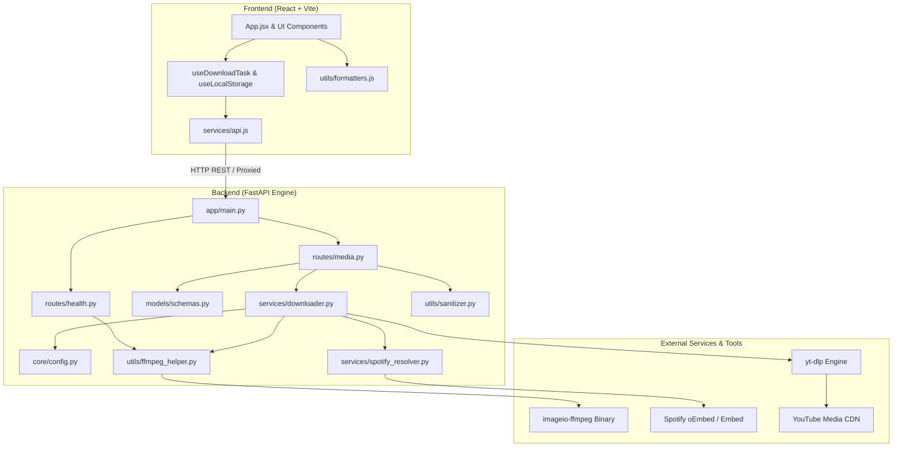

# 🏛️ TuneFetch - System Architecture & Technical Specification

This document provides an exhaustive reference of the architecture, file structures, functions, and cross-module interactions powering the **TuneFetch** platform.

---

## 🗺️ High-Level System Architecture



---

## 🔄 End-to-End Sequence Diagram

```mermaid
sequenceDiagram
    autonumber
    actor User
    participant Frontend as React Frontend (App.jsx)
    participant API as FastAPI Backend (routes/media.py)
    participant Downloader as DownloadManager (services/downloader.py)
    participant Spotify as SpotifyResolver (services/spotify_resolver.py)
    participant YTDLP as yt-dlp / FFmpeg
    participant FS as File System (backend/downloads/)

    %% 1. Metadata Phase
    User->>Frontend: Pastes Spotify / YouTube URL
    Frontend->>API: POST /api/info { url }
    alt is Spotify URL
        API->>Spotify: resolve_spotify_track(url)
        Spotify-->>API: Metadata + ytsearch query
    else is YouTube / Direct URL
        API->>Downloader: extract_info(url, download=False)
        Downloader-->>API: Metadata
    end
    API-->>Frontend: Media metadata payload (title, artist, thumbnail, duration)
    Frontend-->>User: Renders MediaCard / PlaylistCard preview

    %% 2. Download Phase
    User->>Frontend: Selects bitrate (e.g. 320 kbps) & clicks Download
    Frontend->>API: POST /api/download { url, format: "mp3-320", ... }
    API->>Downloader: create_download_task(...)
    Downloader->>Downloader: Spawns background worker thread
    Downloader-->>API: task_id (UUID)
    API-->>Frontend: { success: true, task_id }

    %% 3. Polling & Progress Phase
    loop Every 750ms
        Frontend->>API: GET /api/status/{task_id}
        API->>Downloader: get_task_status(task_id)
        Downloader-->>API: { status, progress, speed, eta }
        API-->>Frontend: Task Status JSON
        Frontend-->>User: Updates animated progress bar
    end

    %% 4. Execution & Conversion
    Downloader->>YTDLP: Download audio stream + FFmpegExtractAudio (MP3 320k)
    YTDLP->>FS: Writes task_id_TrackName.mp3
    Downloader->>Downloader: Mark status = "completed", filepath, filesize

    %% 5. File Retrieval & Auto-Purge Phase
    Frontend->>Frontend: Detects status == "completed", triggers confetti
    User->>Frontend: Clicks "Save MP3 File"
    Frontend->>API: GET /api/file/{task_id}/{filename}
    API->>FS: Reads audio file
    API-->>Frontend: Streaming FileResponse (Content-Disposition: attachment; filename="TrackName.mp3")
    Frontend-->>User: Browser saves "TrackName.mp3" to client Downloads folder
    Note over API,FS: FastAPI BackgroundTasks immediately purges file from server disk!
    API->>Downloader: delete_task_file_safely(task_id)
    Downloader->>FS: os.remove(task_id_TrackName.mp3) (Server disk space reclaimed)
```

---

## 🐍 Backend Architecture Specification

### 1. `backend/app/core/config.py`
**Purpose**: Centralized application configuration and constants.

| Variable | Type | Description |
|---|---|---|
| `BASE_DIR` | `Path` | Absolute path to backend root directory. |
| `DOWNLOADS_DIR` | `str` | Absolute path to temporary audio storage (`backend/downloads`). |
| `APP_TITLE` | `str` | Application name (`TuneFetch Audio Engine`). |
| `APP_VERSION` | `str` | Semantic version string (`1.0.0`). |
| `MAX_FILE_AGE_SECONDS`| `int` | Expiration threshold (3600 seconds = 1 hour) after which temp files are cleaned up. |
| `DEFAULT_BITRATE` | `str` | Default MP3 bitrate (`"320"`). |
| `ALLOWED_FORMATS` | `list` | Permitted audio targets (`mp3-320`, `mp3-256`, `mp3-128`, `best-audio`). |
| `CORS_ORIGINS` | `list` | Cross-Origin Resource Sharing allowlist (`["*"]`). |

---

### 2. `backend/app/models/schemas.py`
**Purpose**: Pydantic data models for strict request validation and response serialization.

| Class | Fields | Purpose |
|---|---|---|
| `InfoRequest` | `url: str` | Validates input URL payload for `/api/info`. |
| `DownloadRequest` | `url: str`, `format: Optional[str]`, `title: Optional[str]`, `artist: Optional[str]`, `thumbnail: Optional[str]` | Validates download request parameters for `/api/download`. |
| `TrackItem` | `id: int`, `title: str`, `artist: Optional[str]`, `duration: Optional[int]`, `thumbnail: Optional[str]`, `url: Optional[str]`, `search_query: Optional[str]` | Represents a single track within a playlist. |
| `MediaInfoResponse` | `is_playlist: bool`, `platform: str`, `title: str`, `artist: Optional[str]`, `thumbnail: Optional[str]`, `duration: Optional[int]`, `track_count: Optional[int]`, `tracks: Optional[List[TrackItem]]`, `original_url: str`, `search_query: Optional[str]`, `formats: Optional[List[str]]` | Typed response for `/api/info`. |
| `TaskStatusResponse` | `id: str`, `url: str`, `title: str`, `artist: str`, `thumbnail: str`, `status: str`, `progress: float`, `speed: str`, `eta: str`, `file_id: Optional[str]`, `filename: Optional[str]`, `filesize: Optional[int]`, `error: Optional[str]`, `created_at: float` | Typed response for `/api/status/{task_id}`. |
| `HealthResponse` | `status: str`, `ffmpeg_available: bool`, `ffmpeg_path: str`, `version: str` | Typed response for `/api/health`. |

---

### 3. `backend/app/utils/ffmpeg_helper.py`
**Purpose**: FFmpeg executable detection and standalone fallback.

| Function | Signature | Description | Connected To |
|---|---|---|---|
| `get_ffmpeg_path()` | `() -> str \| None` | Checks system PATH via `shutil.which("ffmpeg")`. If missing, imports `imageio_ffmpeg` and retrieves `imageio_ffmpeg.get_ffmpeg_exe()`. | Called by `app.services.downloader` (for `yt-dlp` postprocessors) and `app.routes.health`. |

---

### 4. `backend/app/utils/sanitizer.py`
**Purpose**: Filename sanitation, character cleaning, and HTTP header synthesis.

| Function | Signature | Description | Connected To |
|---|---|---|---|
| `sanitize_filename(filename, fallback_ext)` | `(str, str) -> str` | Strips illegal filesystem characters (`<>:"/\|?*`) across operating systems. | Called by `build_content_disposition_header` and `downloader.py`. |
| `build_content_disposition_header(filename, ext)` | `(str, str) -> Tuple[str, str]` | Generates dual-format `Content-Disposition` header: ASCII fallback `filename="..."` and RFC 5987 UTF-8 `filename*=UTF-8''...`, plus MIME content type. | Called by `app.routes.media.download_file()`. |

---

### 5. `backend/app/services/spotify_resolver.py`
**Purpose**: Extracts metadata from Spotify links without requiring private developer API credentials.

| Function | Signature | Description | Connected To |
|---|---|---|---|
| `is_spotify_url(url)` | `(str) -> bool` | Detects if a URL is a Spotify entity. | Called by `downloader.py` and `spotify_resolver.py`. |
| `parse_spotify_type_and_id(url)` | `(str) -> Tuple[Optional[str], Optional[str]]` | Regex extraction of entity type (`track`, `playlist`, `album`) and ID. | Called by resolver functions. |
| `resolve_spotify_track(url)` | `(str) -> Dict[str, Any]` | Queries Spotify oEmbed endpoint and parses Spotify embed HTML to extract track title, artist name, cover art, and duration. Builds `ytsearch` query. | Called by `DownloadManager.get_info()` and `DownloadManager._run_download()`. |
| `resolve_spotify_playlist_or_album(url)` | `(str) -> Dict[str, Any]` | Scrapes Spotify playlist embed JSON state (`__NEXT_DATA__`) to extract full tracklist, individual titles, artists, and artwork. | Called by `DownloadManager.get_info()`. |

---

### 6. `backend/app/services/downloader.py`
**Purpose**: Core media extraction, background worker lifecycle, `yt-dlp` coordination, and task state tracking.

| Function / Method | Signature | Description | Connected To |
|---|---|---|---|
| `cleanup_old_files(max_age_seconds)` | `(int) -> None` | Scans `backend/downloads/` and removes audio files exceeding `MAX_FILE_AGE_SECONDS`. | Called at the start of each download task. |
| `DownloadManager.get_info(url)` | `(str) -> Dict[str, Any]` | Extracts metadata from Spotify or generic/YouTube URLs without triggering audio download. | Invoked by `app.routes.media.fetch_info()`. |
| `DownloadManager.create_download_task(...)` | `(url, format_type, title, artist, thumbnail) -> str` | Generates UUID, creates thread-safe task record in `tasks` dict, and spawns `_run_download` daemon thread. | Invoked by `app.routes.media.start_download()`. |
| `DownloadManager._run_download(...)` | `(task_id, url, format_type, title, artist) -> None` | Thread worker: resolves Spotify queries, configures `yt-dlp` with FFmpeg MP3 postprocessors, monitors progress hook, saves `.mp3`, and updates task status. | Runs in daemon thread. |
| `DownloadManager.get_task_status(task_id)` | `(str) -> Optional[Dict[str, Any]]` | Reads sanitized copy of in-memory task state. | Invoked by `app.routes.media.check_status()`. |
| `DownloadManager.get_task_filepath(task_id)` | `(str) -> Optional[str]` | Finds and returns absolute path of completed audio file on disk. | Invoked by `app.routes.media.download_file()` and `stream_audio()`. |

---

### 7. `backend/app/routes/health.py` & `media.py`
**Purpose**: FastAPI REST controllers exposing API endpoints.

| Route | Method | Controller Function | Description |
|---|---|---|---|
| `/api/health` | `GET` | `health_check()` | Returns server status and FFmpeg path. |
| `/api/info` | `POST` | `fetch_info(req)` | Fetches metadata for single track or playlist. |
| `/api/download` | `POST` | `start_download(req)` | Spawns background download task, returns `task_id`. |
| `/api/status/{task_id}` | `GET` | `check_status(task_id)` | Returns real-time download status & progress percentage. |
| `/api/file/{task_id}` & `/api/file/{task_id}/{requested_filename}` | `GET` | `download_file(task_id, filename)` | Returns audio `FileResponse` with attachment headers. |
| `/api/stream/{task_id}` | `GET` | `stream_audio(task_id)` | Returns streaming `FileResponse` for HTML5 preview player. |

---

### 8. `backend/app/main.py` & `backend/run.py`
**Purpose**: Application setup, middleware attachment, and server launch.

| Function / Component | Description | Connected To |
|---|---|---|
| `create_app()` | Instantiates `FastAPI`, attaches CORS middleware exposing `Content-Disposition`, and includes `health_router` and `media_router`. | Invoked in `main.py`. |
| `run.py` | Launches `uvicorn.run("app.main:app", host="127.0.0.1", port=8000, reload=True)`. | Entrypoint script. |

---

## ⚛️ Frontend Architecture Specification

### 1. `frontend/src/constants/index.js`
**Purpose**: Global constants, platform enums, audio format definitions, and storage keys.

| Constant | Description |
|---|---|
| `STORAGE_KEYS.HISTORY` | Local storage key for persistent download history (`tunefetch_download_history`). |
| `AUDIO_FORMATS` | Array of format definitions (`mp3-320`, `mp3-256`, `mp3-128`, `best-audio`). |
| `PLATFORMS` | Enum mapping (`spotify`, `youtube`, `soundcloud`, `generic`). |
| `EXAMPLE_URLS` | Sample track/playlist URLs for quick UI testing. |

---

### 2. `frontend/src/utils/formatters.js`
**Purpose**: Presentation formatting helpers.

| Function | Signature | Description |
|---|---|---|
| `formatDuration(seconds)` | `(number) -> string` | Converts seconds to `MM:SS` or `HH:MM:SS`. |
| `formatFileSize(bytes)` | `(number) -> string` | Converts bytes to human readable `KB`, `MB`, or `GB`. |
| `formatTimestamp(ts)` | `(number) -> string` | Converts Unix timestamp to localized `HH:MM` time. |
| `sanitizeClientFilename(name, ext)` | `(string, string) -> string` | Ensures client-side file names have valid extensions. |

---

### 3. `frontend/src/services/api.js`
**Purpose**: Frontend HTTP client interacting with the backend REST endpoints.

| Method | Signature | Description | Connected Endpoint |
|---|---|---|---|
| `getHealth()` | `() => Promise<Object>` | Queries server health status. | `GET /api/health` |
| `fetchInfo(url)` | `(string) => Promise<Object>` | Fetches media metadata. | `POST /api/info` |
| `startDownload(params)` | `(Object) => Promise<string>` | Dispatches download job, returns `task_id`. | `POST /api/download` |
| `getStatus(taskId)` | `(string) => Promise<Object>` | Retrieves progress and state of task. | `GET /api/status/{taskId}` |
| `getDownloadUrl(taskId, filename)` | `(string, string) => string` | Constructs URL preserving filename in path. | `GET /api/file/{taskId}/{filename}` |
| `getStreamUrl(taskId)` | `(string) => string` | Constructs streaming playback URL. | `GET /api/stream/{taskId}` |

---

### 4. `frontend/src/hooks/useLocalStorage.js`
**Purpose**: Custom React hook for reactive, synchronized `localStorage` state.

| Hook | Signature | Description |
|---|---|---|
| `useLocalStorage(key, initialValue)` | `(string, any) => [any, Function]` | Synchronizes component state with `window.localStorage` with JSON serialization. |

---

### 5. `frontend/src/hooks/useDownloadTask.js`
**Purpose**: Custom React hook encapsulating download lifecycle, background polling, and completion callbacks.

| Hook / Return | Description | Connected To |
|---|---|---|
| `activeTask` | Current task object (`id`, `progress`, `speed`, `eta`, `status`, `filename`, `filesize`). | Rendered by `ProgressCard`. |
| `activeTrackIndex` | Track ID currently being downloaded in a playlist. | Used by `PlaylistCard`. |
| `error` | Error message string if download fails. | Rendered by `App.jsx`. |
| `startDownload(params)` | Triggers download task via `api.startDownload` and starts interval polling. | Invoked by `MediaCard` and `PlaylistCard`. |
| `resetTask()` | Clears active task state. | Invoked when dismissing progress. |

---

### 6. Component Hierarchy & Interactions

```
App.jsx (Root Controller)
├── Header.jsx (Branding, Health Indicator, History Toggle)
├── HistoryDrawer.jsx (Recent Downloads Drawer, Audio Preview & Re-Download)
├── UrlInput.jsx (URL Input, Platform Detection Badge, Quick Examples, Paste Button)
├── ProgressCard.jsx (Live Animated Progress Bar, Speed, ETA, Save MP3 File Trigger)
├── AudioPlayer.jsx (HTML5 Audio Player, Play/Pause, Scrubber, Volume Slider)
├── MediaCard.jsx (Single Track Preview, Bitrate Quality Selector, Download Button)
└── PlaylistCard.jsx (Playlist Overview, Search Filter, Single Track Download Actions)
```

#### Detailed Component Responsibilities:

- **`Header.jsx`**:
  - Displays TuneFetch logo and title.
  - Automatically queries `/api/health` to render real-time engine readiness badges.
  - Displays history item count badge.

- **`UrlInput.jsx`**:
  - Watches URL input to dynamically display platform tags (`SPOTIFY`, `YOUTUBE`, `SOUNDCLOUD`).
  - Supports `navigator.clipboard.readText()` for single-click pasting.
  - Exposes quick example buttons to test songs and playlists.

- **`MediaCard.jsx`**:
  - Displays cover art, title, artist, and duration badge.
  - Allows selecting output quality (`MP3 • 320 kbps (Ultra HQ)`, `MP3 • 256 kbps`, `MP3 • 128 kbps`, `Original Stream`).
  - Dispatches download requests.

- **`PlaylistCard.jsx`**:
  - Displays playlist artwork, title, and total track count.
  - Includes real-time client-side search input to filter tracks by title or artist.
  - Allows downloading individual tracks with independent progress indicators.

- **`ProgressCard.jsx`**:
  - Visualizes real-time progress (`0%` to `100%`) with animated multi-stop gradient bars.
  - Displays dynamic status (`Downloading...`, `Extracting & Converting to MP3...`, `Completed`).
  - Triggers celebratory confetti on completion.
  - Renders direct "Save MP3 File" button that programmatically clicks a named download link for guaranteed `.mp3` extension preservation.

- **`AudioPlayer.jsx`**:
  - In-browser preview player using HTML5 `<audio>` element.
  - Features real-time scrubber timeline, duration formatting, play/pause toggle, and interactive volume controls.

- **`HistoryDrawer.jsx`**:
  - Displays local download history.
  - Allows instant re-download or browser preview of any previous track.
  - Includes clear history functionality.

---

## 🔗 Cross-Module Data & Control Flow

| User Action | Frontend Function Flow | Backend Function Flow | Result |
|---|---|---|---|
| **Enter URL & click "Get Audio"** | `UrlInput.onSubmit` -> `App.handleFetchInfo` -> `api.fetchInfo(url)` | `routes.media.fetch_info` -> `services.downloader.get_info` -> `services.spotify_resolver` | Media metadata rendered in `MediaCard` or `PlaylistCard`. |
| **Select 320 kbps & click "Download MP3"** | `MediaCard.handleDownloadClick` -> `useDownloadTask.startDownload` -> `api.startDownload` | `routes.media.start_download` -> `DownloadManager.create_download_task` | Background thread starts `yt-dlp` audio extraction and MP3 encoding. Returns `task_id`. |
| **Download In-Progress** | `useDownloadTask` setInterval -> `api.getStatus(task_id)` | `routes.media.check_status` -> `DownloadManager.get_task_status` | Animated progress bar updates with %, speed, and ETA. |
| **Download Finishes** | `useDownloadTask` detects `status == "completed"` -> triggers `onComplete` -> `App.handleTaskCompleted` | In-memory task updated with `filename` and `filepath`. | Item saved to `localStorage` history; Confetti fired. |
| **Click "Save MP3 File"** | `ProgressCard.handleDirectDownload` creates `<a download="Title.mp3" href="/api/file/{id}/Title.mp3">` | `routes.media.download_file` -> `utils.sanitizer.build_content_disposition_header` | Browser downloads `.mp3` file with proper title and MIME type. |
| **Click "Preview Audio"** | `ProgressCard.onPlayAudio` -> `App.setPlayingTrack` -> `AudioPlayer.useEffect` -> `api.getStreamUrl` | `routes.media.stream_audio` | Audio streams directly in HTML5 player. |
