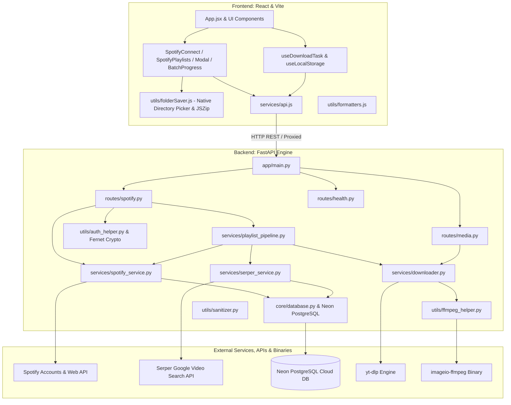
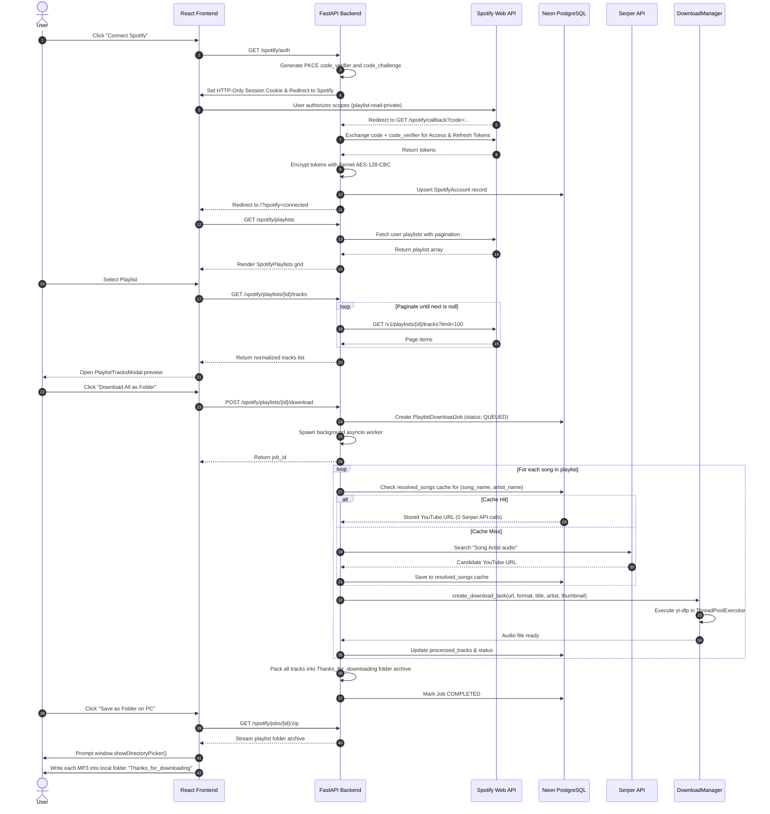

# 🏛️ TuneFetch - System Architecture & Technical Specification

This document provides an exhaustive reference of the architecture, file structures, functions, and cross-module interactions powering the **TuneFetch** platform.

---

## 🗺️ High-Level System Architecture

---

## 🔄 Spotify OAuth & Batch Playlist Sequence Diagram

---

## 📂 File-by-File Technical Specification

### 1. Backend Layer (`backend/app/`)

#### `core/config.py`
- Configuration parameters:
  - `DATABASE_URL`: PostgreSQL connection string (Neon DB).
  - `ENCRYPTION_KEY`: Fernet 32-byte urlsafe base64 key for encrypting Spotify tokens at rest.
  - `SESSION_SECRET_KEY`: Signed session secret for HMAC multi-user identification.
  - `SPOTIFY_CLIENT_ID`, `SPOTIFY_CLIENT_SECRET`, `SPOTIFY_REDIRECT_URI`: Spotify OAuth credentials.
  - `SERPER_API_KEY`: Serper candidate search API key.
  - `MAX_FILE_AGE_SECONDS`: Background cleanup threshold (7,200 seconds / 2 hours).

#### `core/database.py`
- Objects: `engine` (with `pool_pre_ping=True`, `pool_recycle=300`), `SessionLocal`, `Base`.
- Function `get_db()`: Dependency yielding database session per request.
- Function `init_db()`: Table creation and dynamic column migration safety check.

#### `models/db_models.py`
- **Model `User`**: Multi-user account (`id`, `created_at`, `last_seen_at`).
- **Model `SpotifyAccount`**: Linked Spotify credentials encrypted at rest (`id`, `user_id`, `spotify_user_id`, `access_token`, `refresh_token`, `expires_at`, `scope`, `display_name`).
- **Model `PlaylistDownloadJob`**: Batch download tracking (`id`, `user_id`, `playlist_id`, `playlist_name`, `total_tracks`, `processed_tracks`, `successful_tracks`, `failed_tracks`, `status`, `tracks_data`, `zip_path`, `zip_filename`, `created_at`).
- **Model `ResolvedSong`**: Global shared candidate cache (`id`, `song_name`, `artist_name`, `song_name_clean`, `artist_name_clean`, `candidate_url`, `created_at`).

#### `utils/auth_helper.py`
- Function `encrypt_token(raw_token)`: Fernet symmetric encryption.
- Function `decrypt_token(cipher_token)`: Fernet symmetric decryption.
- Function `sign_session_id(user_id)` / `unsign_session_id(cookie)`: ItsDangerous cryptographic signing.
- Function `get_current_user(...)`: Resolves or provisions user from HTTP-Only cookie.

#### `services/spotify_service.py`
- PKCE OAuth URL generator, token exchange, and transparent token refresher.
- Pagination engine extracting full playlists up to 1,400+ tracks.
- Conflict-safe account reconnection handling duplicate Spotify user IDs across sessions.

#### `services/serper_service.py`
- Two-tier candidate resolution:
  1. Checks `resolved_songs` table for exact match on clean `song_name` and `artist_name`.
  2. If missing, queries Serper API (`site:youtube.com/watch "song" "artist"`), then saves to DB.
  3. Seamless `ytsearch1:` fallback if Serper is unconfigured.

#### `services/playlist_pipeline.py`
- Asynchronous batch worker thread sequentially processing tracks:
  - Updates live ETA estimates.
  - Passes candidate URLs into `DownloadManager`.
  - Packages all tracks into folder `Thanks_for_downloading/` within the job archive.

#### `services/downloader.py`
- High-performance `yt-dlp` download manager with bounded thread pools, progress hooks, and MP3 audio extraction via embedded FFmpeg.

#### `routes/spotify.py`
- Endpoints:
  - `GET /spotify/auth`: Initiates Spotify OAuth login with PKCE.
  - `GET /spotify/callback`: OAuth callback handler.
  - `GET /spotify/status`: Returns current user's Spotify link state.
  - `POST /spotify/disconnect`: Disconnects Spotify account.
  - `GET /spotify/playlists`: Fetches user's Spotify playlists.
  - `GET /spotify/playlists/{id}/tracks`: Fetches all tracks with pagination.
  - `POST /spotify/playlists/{id}/download`: Dispatches batch download job.
  - `GET /spotify/jobs/latest`: Retrieves user's latest or completed batch job.
  - `GET /spotify/jobs/{id}`: Polls batch job progress and live ETA.
  - `GET /spotify/jobs/{id}/zip`: Delivers the packaged folder archive.

#### `run.py`
- Launcher script with **automatic virtual environment detection**: automatically executes with `backend\venv\Scripts\python.exe` if executed from global Python.

---

### 2. Frontend Layer (`frontend/src/`)

#### `App.jsx`
- Clean two-tab controller: **Home** & **Spotify Downloader**.
- Auto-restores completed or in-progress batch download cards via `/spotify/jobs/latest`.
- Handles modal state, single track preview playback, and notification toasts.

#### `components/Spotify/`
- **`SpotifyConnect.jsx`**: Spotify OAuth connection card (hidden automatically once linked).
- **`SpotifyPlaylists.jsx`**: Responsive grid of playlists with real-time search filtering.
- **`PlaylistTracksModal.jsx`**: Full track inspection modal with "Download All as Folder" action.
- **`BatchProgressCard.jsx`**: Real-time batch progress dashboard with live countdown timer and direct **"Save as Folder on PC"** button.

#### `utils/folderSaver.js`
- Implements `saveZipAsFolder()` using **File System Access API (`window.showDirectoryPicker`)** and **JSZip**.
- Extracts MP3 files from the server response and writes them directly into the Windows folder `Thanks_for_downloading` on the user's PC.

---

## 🔒 Security & Multi-User Isolation

1. **Encrypted Tokens at Rest**: All access and refresh tokens are encrypted using **Fernet AES-128-CBC + HMAC-SHA256**.
2. **Server-Side API Keys**: Spotify Client Secret and Serper API key never touch client code.
3. **User Isolation**: Jobs and accounts are strictly partitioned by `user_id`.
4. **Signed HTTP-Only Session Cookies**: Prevents cross-site scripting (XSS) token exfiltration.
