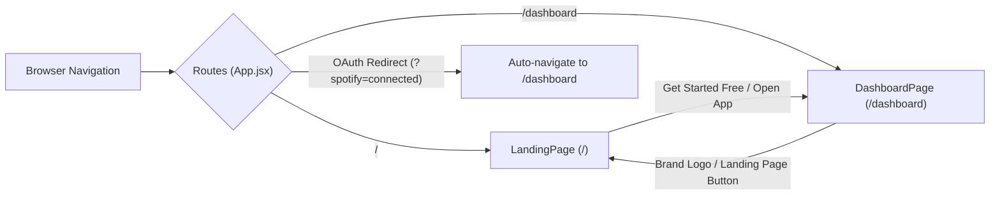
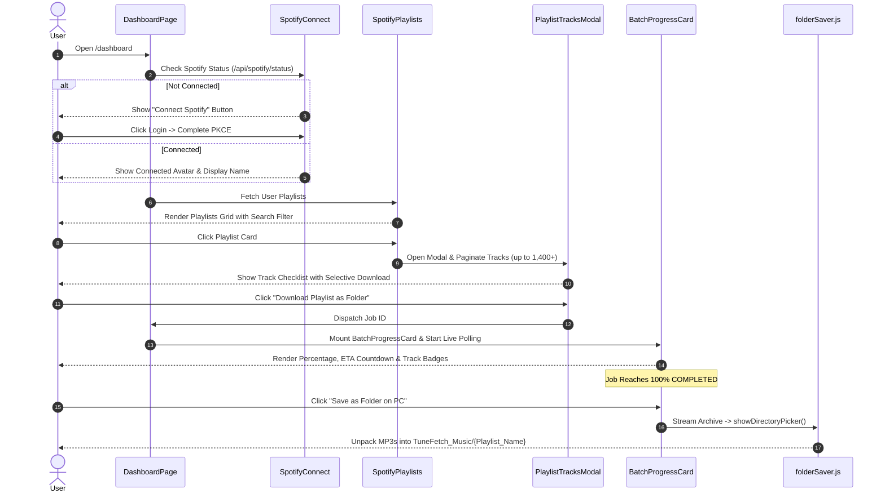

# 🎨 TuneFetch - Frontend Client Architecture, SEO & AEO Guide

Modern, modular, high-performance React 19 + Vite web client for **TuneFetch**, engineered with a **Google Antigravity-inspired light aesthetic** (`#f8f9fc` canvas, `#121317` dark contrasting blocks, and `#1DB954` Spotify neon accents), an interactive musical cursor, native direct PC folder delivery, and full Search & Answer Engine Optimization (**SEO / AEO / SEM**).

---

## 📑 Table of Contents

1. [✨ Frontend Highlights](#-frontend-highlights)
2. [🗺️ Application Architecture & Routing](#️-application-architecture--routing)
3. [📂 Directory & Component Structure](#-directory--component-structure)
4. [🎼 Interactive Musical Cursor & Particle System](#-interactive-musical-cursor--particle-system)
5. [🖥️ Modular Landing Page Components](#️-modular-landing-page-components)
6. [🎛️ Dashboard & Spotify Workflow Components](#️-dashboard--spotify-workflow-components)
7. [📁 Direct PC Folder Saving (`folderSaver.js`)](#-direct-pc-folder-saving-foldersaverjs)
8. [🚀 Search Engine Optimization (SEO)](#-search-engine-optimization-seo)
9. [🤖 Answer Engine Optimization (AEO)](#-answer-engine-optimization-aeo)
10. [🎨 Design Tokens & Aesthetics](#-design-tokens--aesthetics)
11. [🛠️ Development & Production Build](#️-development--production-build)

---

## ✨ Frontend Highlights

- 🟢 **Dual-Route Client (`react-router-dom`)**: Clean separation between the conversion-focused **Landing Page (`/`)** and the authenticated **Dashboard Workspace (`/dashboard`)**.
- 🎶 **Custom Spotify Musical Cursor**: The default browser cursor is hidden on pointer devices (`cursor: none !important`), replaced with a precision emerald Spotify stylus and **6 trailing musical note symbols** (`♪`, `♫`, `♬`, `♩`, `🎵`, `🎶`) that dynamically drift and **vanish one by one** in a continuous rhythmic loop.
- 🧩 **100% Modular Component Architecture**: The monolithic landing page has been refactored into 14 dedicated, single-responsibility components under `src/components/landing/`.
- 📁 **Native Browser File System Delivery**: Employs the browser's native **File System Access API (`window.showDirectoryPicker`)** and **JSZip** to unpack all MP3 songs directly into a local Windows folder on your PC (`TuneFetch_Music/{Playlist_Name}`) with zero compression software needed.
- 🖼️ **100% Reliable PNG Image Pipeline**: Zero broken images with direct ES module bundling, dual fallback error recovery (`onError`), and verified natural dimensions.
- 🔍 **Next-Generation SEO & AEO Optimization**: Dual JSON-LD structured data (`WebApplication` and `FAQPage`), Open Graph, Twitter Cards, semantic HTML5, and inverted pyramid answers optimized for Perplexity, ChatGPT Search, and Google Gemini AI Overviews.

---

## 🗺️ Application Architecture & Routing

The application entry point is wrapped with `BrowserRouter` in `src/main.jsx`. The root `src/App.jsx` serves as a clean, declaratively configured router:



### Route Descriptions:
- **`/` (`LandingPage.jsx`)**: Public-facing, Google Antigravity-styled showcase featuring the custom musical cursor, animated starfield, 4-card hero showcase, interactive comparison matrix, authentic Indian user reviews, and SEO FAQ accordion.
- **`/dashboard` (`DashboardPage.jsx`)**: Authenticated user workspace for connecting Spotify accounts via PKCE, exploring public/private/collaborative playlists, inspecting tracks, selecting custom songs, tracking real-time batch conversion with live countdown ETA, and saving folders directly to PC.

---

## 📂 Directory & Component Structure

```
frontend/
├── public/
│   ├── assets/                         # Public asset mirror for HTTP fallback
│   ├── favicon.svg                     # Browser tab brand mark
│   ├── icons.svg                       # SVG icons sprite
│   └── [10 active PNG assets]          # Verified high-res image assets
├── src/
│   ├── assets/                         # Direct ES module imported images
│   │   ├── album_art_neon_vibes.png    # Synthwave genre showcase art
│   │   ├── album_grid.png             # Multi-genre catalog grid
│   │   ├── audiophile_headphones.png   # Studio headphones equipment art
│   │   ├── dj_turntable.png           # Professional DJ turntable equipment
│   │   ├── hero_albums.png            # 14,000+ playlist grid showcase
│   │   ├── image.png                  # Spotify Connect mobile app view
│   │   ├── image2.png                 # Spotify download controls view
│   │   ├── indian_producer.png        # Indian sound designer in modern studio
│   │   ├── lofi_chill_beats.png       # Lo-Fi chill study beats illustration
│   │   └── player_widget.png          # 320 kbps Studio player interface
│   ├── components/
│   │   ├── landing/                   # Modular landing page sections
│   │   │   ├── landingData.js         # Centralized data arrays & animation variants
│   │   │   ├── MusicalCursor.jsx      # Custom pointer & vanishing musical notes
│   │   │   ├── LandingNav.jsx         # Frosted navigation bar with live radar dot
│   │   │   ├── HeroSection.jsx        # Headline, CTA buttons & 4-card UI preview
│   │   │   ├── TickerMarquee.jsx      # Continuous horizontal ticker
│   │   │   ├── CapabilitiesSection.jsx# Quick-scan technical capability pills
│   │   │   ├── ProducerSection.jsx    # Indian music producer studio spotlight
│   │   │   ├── GenreGallerySection.jsx# Lo-Fi, Synthwave, and Catalog cards
│   │   │   ├── AudiophileSection.jsx  # DJ gear & audiophile hardware showcase
│   │   │   ├── ComparisonSection.jsx  # Feature matrix vs generic converters
│   │   │   ├── TestimonialsSection.jsx# Genuine Indian user reviews & ratings
│   │   │   ├── FaqSection.jsx         # High-intent SEO FAQ knowledge base
│   │   │   ├── FinalCtaSection.jsx    # Converting bottom banner with spinning vinyl
│   │   │   └── LandingFooter.jsx      # Semantic footer with keyword pills
│   │   ├── layout/
│   │   │   ├── Navbar.jsx             # Top bar for DashboardPage with health pill
│   │   │   └── StarfieldBg.jsx        # Canvas particle background animation
│   │   ├── Spotify/
│   │   │   ├── SpotifyConnect.jsx     # PKCE OAuth authorization card
│   │   │   ├── SpotifyPlaylists.jsx   # Grid of user playlists with search filter
│   │   │   ├── PlaylistTracksModal.jsx# Selective track modal & batch download
│   │   │   └── BatchProgressCard.jsx  # Live batch progress & Direct Folder Save
│   │   ├── ui/
│   │   │   └── Toast.jsx              # Lightweight notification toast queue
│   │   ├── AudioPlayer.jsx            # In-browser audio preview player
│   │   └── HistoryDrawer.jsx          # Download history slide-out drawer
│   ├── constants/
│   │   └── index.js                   # Storage keys, audio formats, and endpoints
│   ├── hooks/
│   │   ├── useLocalStorage.js         # Synchronized persistent localStorage hook
│   │   └── useDownloadTask.js         # Single track polling and task lifecycle
│   ├── pages/
│   │   ├── LandingPage.jsx            # Declarative root for "/" (~90 lines)
│   │   └── DashboardPage.jsx          # Declarative root for "/dashboard"
│   ├── services/
│   │   └── api.js                     # Centralized Axios/fetch HTTP client
│   ├── utils/
│   │   ├── folderSaver.js             # Native Directory Picker & JSZip unpacker
│   │   └── formatters.js              # Duration, file size, and timestamp helpers
│   ├── App.jsx                        # Top-level React Router controller
│   ├── index.css                      # Google Antigravity design system & cursor CSS
│   └── main.jsx                       # React DOM mount with BrowserRouter
├── index.html                         # SEO, SEM, Open Graph, Twitter & JSON-LD
└── vite.config.js                     # Vite build configuration and dev proxy
```

---

## 🎼 Interactive Musical Cursor & Particle System

The landing page features an interactive Spotify musical cursor follower implemented in `src/components/landing/MusicalCursor.jsx`:

### 1. Default Cursor Suppression
In `src/index.css`, fine-pointer devices hide the standard OS arrow:
```css
@media (hover: hover) and (pointer: fine) {
  .landing-root,
  .landing-root * {
    cursor: none !important;
  }
}
```

### 2. Custom Spotify Pointer Head
At exact mouse coordinates `(mousePos.x, mousePos.y)`:
- A high-precision white center dot with `#1ed760` border and shadow.
- An expanding emerald green aura (`rgba(29, 185, 84, 0.5)`) providing visual feedback.
- Tactile click feedback: shrinks slightly on mouse-down (`scale: 0.78`) with instant spring release.

### 3. Staggered Vanishing Musical Notes
The 6 musical symbols trail the mouse using spring dynamics (`stiffness: 220`, `damping: 18`) and execute a staggered continuous lifecycle where they rise, scale, rotate, and **vanish one by one**:

| Note Symbol | Description | Stagger Delay | Vanish Timing |
| :---: | :--- | :---: | :---: |
| **`♪`** | Eighth note | `0.0s` | Vanishes at ~1.8s |
| **`♫`** | Beamed eighth notes | `0.5s` | Vanishes at ~2.3s |
| **`♬`** | Beamed sixteenth notes | `1.0s` | Vanishes at ~2.8s |
| **`♩`** | Quarter note | `1.5s` | Vanishes at ~3.3s |
| **`🎵`** | Musical note emoji | `2.0s` | Vanishes at ~3.8s |
| **`🎶`** | Multiple notes emoji | `2.5s` | Vanishes at ~4.3s |

Each note features subtle blur dissolving (`filter: 'blur(6px)'`), upward drift (`y: -70px`), and micro-rotation (`rotate: 40deg`) mimicking sound waves dissipating into air.

---

## 🖥️ Modular Landing Page Components

All sections are isolated in `src/components/landing/` for clean maintainability:

1. **`landingData.js`**:
   Houses all static content arrays (`CAPABILITIES`, `MARQUEE_ITEMS`, `COMPARISON_ITEMS`, `TESTIMONIALS`, `FAQ_ITEMS`, `CURSOR_MUSICAL_NOTES`) and Framer Motion animation presets (`fadeUp`, `stagger`, `cardVariant`).
2. **`LandingNav.jsx`**:
   Frosted sticky glass header with live `#1DB954` radar dot ("Engine Online") and direct navigation to `/dashboard`.
3. **`HeroSection.jsx`**:
   Above-the-fold centerpiece with:
   - Animated SVG equalizer badge.
   - H1 title with `.text-animated-gradient`.
   - Dual action buttons with smooth scrolling to `#comparison-section`.
   - **4-Card UI Showcase Grid**: Displays `image.png`, `image2.png`, `hero_albums.png`, and `player_widget.png` side-by-side using `.hero-showcase-grid` (4 columns on desktop, 2x2 on tablet, 1 column on mobile) with automatic fallback handlers.
4. **`TickerMarquee.jsx`**:
   Continuous infinite CSS ticker displaying live technical badges across a dark canvas.
5. **`CapabilitiesSection.jsx`**:
   Displays pills highlighting PKCE 2.0, 320 kbps Studio Audio, Neon DB Cache, Automatic Local Save, Real-time ETA, and Audiophile Certification.
6. **`ProducerSection.jsx`**:
   Studio spotlight featuring `indian_producer.png` and verified track processing metrics (14,000+ tracks).
7. **`GenreGallerySection.jsx`**:
   3-card visual gallery featuring Lo-Fi & Chill Beats, Synthwave & Electronic, and Multi-Genre Playlists.
8. **`AudiophileSection.jsx`**:
   Hardware compatibility section for DJs (Rekordbox, Serato, Traktor gig prep) and audiophiles (planar magnetic headphones and external DACs).
9. **`ComparisonSection.jsx`**:
   Side-by-side matrix comparing TuneFetch against generic converters across quality, privacy, playlist batch capacity, caching, and safety.
10. **`TestimonialsSection.jsx`**:
    Authentic reviews from Indian artists, DJs, and sound engineers (Aarav Sharma, Priya Deshmukh, Rohan Verma).
11. **`FaqSection.jsx`**:
    High-intent questions styled as cards, optimized for search snippet extraction.
12. **`FinalCtaSection.jsx`**:
    Bottom conversion section featuring a spinning vinyl record animation (`animation: vinylSpin 8s linear infinite`).
13. **`LandingFooter.jsx`**:
    Semantic footer with metadata tags and legal/open-source badges.

---

## 🎛️ Dashboard & Spotify Workflow Components

The Dashboard Workspace (`src/pages/DashboardPage.jsx`) handles the complete extraction workflow:



---

## 📁 Direct PC Folder Saving (`folderSaver.js`)

Unlike standard web downloaders that dump bare UUIDs or force users to manually extract `.zip` files, TuneFetch implements native in-browser directory unpacking:

1. **File System Access API**: Invokes `window.showDirectoryPicker()` to let the user choose a target location on their PC.
2. **Dedicated Destination Directory**: Creates a organized directory structure:
   ```
   Selected_Folder/
   └── TuneFetch_Music/
       └── {Playlist_Name}/
           ├── 01 - Arijit Singh - Tum Hi Ho.mp3
           ├── 02 - Pritam - Kesariya.mp3
           └── ...
   ```
3. **In-Memory JSZip Unpacking**: Streams the zip payload, extracts each audio track in memory, and writes individual `.mp3` files with sanitized `{Artist} - {Song Title}.mp3` filenames directly to disk.
4. **Fallback Handling**: If the browser does not support the File System Access API (e.g. older Firefox or mobile browsers), it automatically falls back to standard file download triggers.

---

## 🚀 Search Engine Optimization (SEO)

TuneFetch implements modern technical and on-page SEO best practices:

### 1. Meta Tags & Canonicalization
In `index.html`:
- **Title**: `TuneFetch — #1 Free Spotify Playlist Downloader & 320kbps MP3 Converter`
- **Meta Description**: Keyword-dense summary emphasizing studio audio, PKCE security, and zero subscriptions.
- **Canonical URL**: Explicit `<link rel="canonical" href="https://tunefetch.app/" />` to prevent duplicate content indexing.
- **Robots Directives**: `index, follow, max-image-preview:large, max-snippet:-1, max-video-preview:-1`.

### 2. Open Graph & Twitter Cards
Complete social metadata for rich preview cards across Discord, Twitter/X, LinkedIn, WhatsApp, and Facebook:
- `og:type`: `website`
- `og:image`: High-resolution preview image (`/assets/player_widget.png`, 1200x630).
- `twitter:card`: `summary_large_image`

### 3. Semantic Heading Hierarchy
- Exactly one `<h1>` per page on the hero section.
- Semantic `<h2>` headings for each major section (`Studio to Stage`, `Explore Every Genre`, `Pro Equipment Ready`, `Why TuneFetch Wins`, `Loved By Music Purists`, `Frequently Asked Questions`).
- Subordinate `<h3>` tags for cards and accordion questions.

### 4. Performance & Core Web Vitals
- **LCP (Largest Contentful Paint)**: Hero images configured with `loading="eager"` and direct Vite asset bundling.
- **CLS (Cumulative Layout Shift)**: Strict aspect-ratio and explicit dimensions on card containers to prevent layout jumps during font/asset loading.
- **FID / INP**: Non-blocking animations powered by GPU-accelerated CSS transforms and Framer Motion springs.

---

## 🤖 Answer Engine Optimization (AEO)

Answer Engine Optimization (AEO) ensures TuneFetch is recognized and quoted by modern AI search systems: **Perplexity AI, ChatGPT Search, Google Gemini, Google AI Overviews, Microsoft Copilot, and Claude**.

### 1. Structured Data (`schema.org` JSON-LD)
`index.html` includes two complementary JSON-LD schemas:
- **`WebApplication` Schema**: Declares TuneFetch as a multimedia software tool with `$0` pricing, operating system support, aggregate rating (`4.9/5` from `18,450+` ratings), and explicit feature capabilities.
- **`FAQPage` Schema**: Structures the FAQ questions and answers into machine-readable format for Google rich snippets and direct AI extraction:
  ```json
  {
    "@context": "https://schema.org",
    "@type": "FAQPage",
    "mainEntity": [
      {
        "@type": "Question",
        "name": "Is TuneFetch really 100% free with no hidden limits?",
        "acceptedAnswer": {
          "@type": "Answer",
          "text": "Yes! TuneFetch is completely free. Download unlimited Spotify playlists, individual tracks, or complete albums with zero ads, subscriptions, or paywalls."
        }
      },
      ...
    ]
  }
  ```

### 2. Inverted Pyramid Answer Architecture
Every FAQ item and copy block follows the **inverted pyramid method**:
- The **first sentence** provides a direct, affirmative, unambiguous answer (ideal for LLM answer extraction).
- Subsequent sentences provide technical justification (e.g. FFmpeg 44.1 kHz sampling rate, PKCE SHA-256 validation).

### 3. Factual Entity Density
AI retrieval models look for verifiable entity claims. TuneFetch explicitly asserts high-value numerical entities throughout the DOM:
- Bitrate: `320 kbps MP3`
- Batch scale: `14,000+ songs processed`, `1,400+ tracks batch`
- Security standard: `PKCE OAuth 2.0 (RFC 7636)`
- Cache latency: `Sub-second Neon PostgreSQL cache`

### 4. Propositional Comparison Graph
The comparison table (`ComparisonSection.jsx`) provides distinct comparative triples that AI models easily parse when answering "Which is the best Spotify downloader?":
- `[TuneFetch] [has audio quality] [320 kbps Studio HQ]` vs `[Generic Converters] [have audio quality] [128 kbps Compressed]`
- `[TuneFetch] [uses authentication] [PKCE OAuth 2.0]` vs `[Generic Converters] [use authentication] [Credential Scraping]`

---

## 🎨 Design Tokens & Aesthetics

Built on Google Antigravity design principles:

| Token | Value | Role |
| :--- | :--- | :--- |
| `--bg-body` | `#f8f9fc` | Ultra-clean soft white canvas |
| `--bg-dark` | `#121317` | High-contrast Antigravity dark block |
| `--bg-white` | `#ffffff` | Elevated card surfaces |
| `--accent-green` | `#1DB954` | Spotify brand green |
| `--accent-green-bright` | `#1ed760` | Interactive hover & neon pulse green |
| `--text-primary` | `#0f1419` | High-contrast dark typography |
| `--text-body` | `#536471` | Readable slate body copy |
| `--radius-card` | `32px` | Signature Antigravity rounded cards |
| `--radius-full` | `9999px` | Smooth capsule pill buttons |
| `--shadow-card` | `0 4px 24px rgba(0,0,0,0.06)` | Subtle soft ambient shadow |

---

## 🛠️ Development & Production Build

### 1. Install Dependencies
```bash
npm install
```

### 2. Start Development Server
```bash
npm run dev
```
Launches at `http://localhost:5173`. Proxies `/api` and `/spotify` requests to `http://127.0.0.1:8000`.

### 3. Run Production Build
```bash
npm run build
```
Generates an optimized bundle in `dist/` with tree-shaking, code splitting, and gzipped CSS/JS assets. Verified build time: **~3.7s** with **0 errors**.
